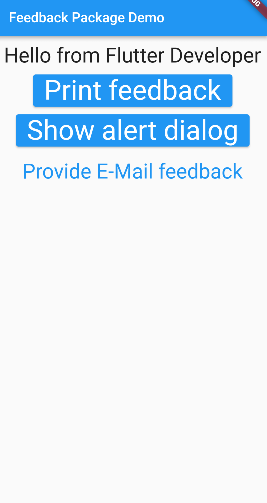
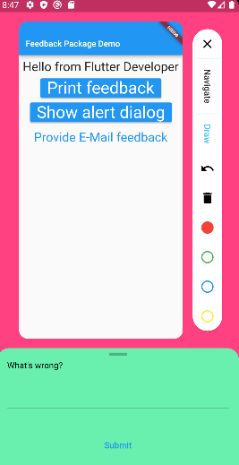
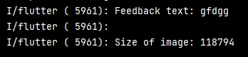
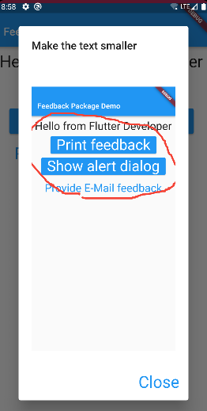
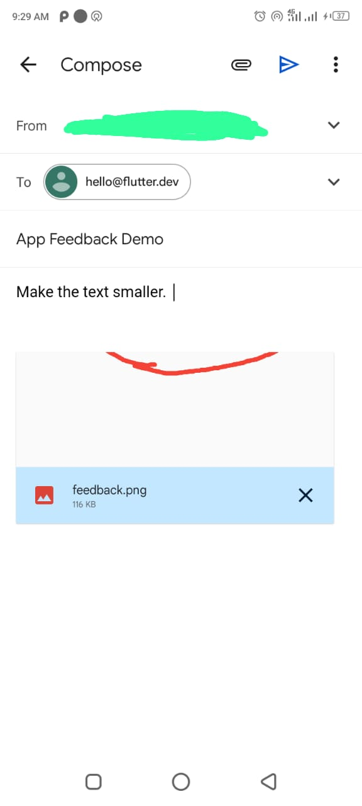

## 1. Research: Feedback Package Flutter

- Keywords:
    - feedback package in flutter
    - feedback flutter
    - flutter rating bar
    - flutter feedback form
    - feedback form flutter
    - in app review flutter example
    - flutter send email in background
    - flutter send email in background
    - flutter rating dialog
    - in app rating flutter
    - advanced in app review flutter
    - in app review flutter example

- Video Title: Feedback Package in Flutter - Flutter Feedback form, in app review and rating bar

## 2. Research: Competitors

**Flutter Videos/Articles**

- 596: https://www.youtube.com/watch?v=3FAD0P6Pk0o
- 393: https://www.youtube.com/watch?v=ygpIljfpCNU
- 244: https://www.youtube.com/watch?v=4_X7Hyuz5IY
- https://pub.dev/packages/feedback
- https://pub.dev/documentation/feedback/latest/
- https://morioh.com/p/86d8b449600b
- https://morioh.com/p/aa07de228e22
-

**Android/Swift/React Videos**

- 6.2K: https://www.youtube.com/watch?v=X8BZ4ASlN4I
- 11K: https://www.youtube.com/watch?v=JRxr62pbFZU
- 444: https://www.youtube.com/watch?v=M4-rIuhDZ3E
- 1K: https://www.youtube.com/watch?v=zLGxdJU9yDQ
- 15K: https://www.youtube.com/watch?v=kUBpgFmVdNU
- 1.8K: https://www.youtube.com/watch?v=9ZkiY373CHk
- 4.3K: https://www.youtube.com/watch?v=lWIrjSp4kCM
- https://www.zonkafeedback.com/android-survey-app
- https://medium.com/@jonathanjojo38/various-ways-to-show-feedback-message-in-android-aab3c3a42d94
- https://github.com/usabilla/usabilla-u4a-ios-swift-sdk
- https://www.npmjs.com/package/feedback-plugin
- https://cefasgpereira.medium.com/implementing-a-feedback-screen-in-react-native-c7621ab9310c

**Great Features**

- It allows the user to give feedback of any page directly in the app.

**Problems from Videos**

- Question: How to show this image in gallery?
  <br/> Answer: For this purpose, you need to use the plugin like gallery_saver because for now
  flutter don't have complete rights to access the gallery directory. It can be done by using the
  platform channels if you want to do it without external plugin.

**Problems from Flutter Stackoverflow**

- NA

## 3. Video Structure

**Main Points / Purpose Of Lesson**

1. In this video lesson, you will learn how to use feedback flutter package to give feedback of any
   page of app.
2. Main Points:
    - Give feedback and print its results in the console
    - Give feedback and shows its output result in the form of image and text on a new screen
    - Give feedback by sending email to a specific address
3. In this way, you can easily manage the feedback of your users. You can also upload user feedback
   to a server.

**The Structured Main Content**

1. Run `dart pub add feedback` to add the latest version of `feedback` package in your
   project's `pubspec.yaml` file.
2. Also add `path_provider` to save feedback image in files and `flutter_email_sender` to email
   feedback with feedback image attached.
3. In `main.dart`, import feedback package and wrap your `MaterialApp` class with `BetterFeedback`
   class like this:

```dart 
import 'package:feedback/feedback.dart';
import 'package:flutter/material.dart';

import 'home_page.dart';

void main() => runApp(const MyApp());

class MyApp extends StatelessWidget {
  const MyApp({super.key});

  @override
  Widget build(BuildContext context) => BetterFeedback(
        theme: FeedbackThemeData(
          background: Colors.pinkAccent,
          feedbackSheetColor: Colors.greenAccent,
          feedbackSheetHeight: 0.25,
          activeFeedbackModeColor: Colors.lightBlueAccent,
          sheetIsDraggable: true,
          // drawColors: [],
        ),
        child: MaterialApp(
        ...
              ),
        );
```

If you hover over `BetterFeedback` and click with the control button then you can see its properties
and default values.

- You can do localization of feedback page with `localizationsDelegates`.
- `feedbackBuilder` is used to create custom feedback.
- You can also change the theme of feedback page by `theme` property.
  <br/>
  
  <br/>
  <br/>
  
  <br/>

4. In `home_page.dart` file:

- **First button** is print feedback in console:
  <br/>
  
  <br/>

```dart 
              ElevatedButton(
                onPressed: () {
                  BetterFeedback.of(context).show(
                    (feedback) => consoleFeedbackFunction(feedback),
                  );
                },
                child: const Text('Print feedback'),
              ),
```

`consoleFeedbackFunction` method is in `feedback_functions.dart`:

```dart
void consoleFeedbackFunction(feedback) {
  debugPrint('Feedback text: ${feedback.text}');
  debugPrint('\nSize of image: ${feedback.screenshot.length}');
  if (feedback.extra != null) {
    debugPrint('Extras: ${feedback.extra!.toString()}');
  }
}
```

- **Second button** is show alert dialog of feedback as a preview:
  <br/>
  
  <br/>

```dart 
              ElevatedButton(
                child: const Text('Show alert dialog'),
                onPressed: () {
                  BetterFeedback.of(context).show(
                    (feedback) async => alertFeedbackFunction(
                      context,
                      feedback
                    ),
                  );
                },
              ),
```

`alertFeedbackFunction` method shows alert dialog preview of feedback. This method is
in `feedback_functions.dart`:

```dart
void alertFeedbackFunction(context, feedback) =>
    showDialog<void>(
      context: context,
      builder: (context) {
        return AlertDialog(
          title: Text(feedback.text),
          content: SingleChildScrollView(
            child: Column(
              mainAxisSize: MainAxisSize.min,
              children: [
                if (feedback.extra != null) Text(feedback.extra!.toString()),
                Image.memory(
                  feedback.screenshot,
                  height: 600,
                  width: 500,
                  fit: BoxFit.contain,
                ),
              ],
            ),
          ),
          actions: [
            TextButton(
              child: const Text('Close'),
              onPressed: () => Navigator.pop(context),
            ),
          ],
        );
      },
    );
```

- **Third button** is provide feedback through email:
  <br/>
  
  <br/>

```dart 
              TextButton(
                onPressed: () {
                  BetterFeedback.of(context).show((feedback) async {
                    // draft an email and send to developer
                    final screenshotFilePath =
                        await writeImageToStorage(feedback.screenshot);

                    final Email email = Email(
                      body: feedback.text,
                      subject: 'App Feedback Demo',
                      recipients: ['hello@flutter.dev'],
                      attachmentPaths: [screenshotFilePath],
                      isHTML: false,
                    );
                    await FlutterEmailSender.send(email);
                  });
                },
                child: const Text('Provide E-Mail feedback'),
              ),
```

`writeImageToStorage` method uses path_provider package to save feedback image in files.:

```dart
Future<String> writeImageToStorage(Uint8List feedbackScreenshot) async {
  final outputDirectory = await getTemporaryDirectory();
  final screenshotFilePath = '${outputDirectory.path}/feedback.png';
  final screenshotFile = File(screenshotFilePath);
  await screenshotFile.writeAsBytes(feedbackScreenshot);
  return screenshotFilePath;
}
```

6. You can also upload this feedback to any server like firebase or gitlab or any website by
   visiting [pub.dev/packages/feedback](https://pub.dev/packages/feedback).